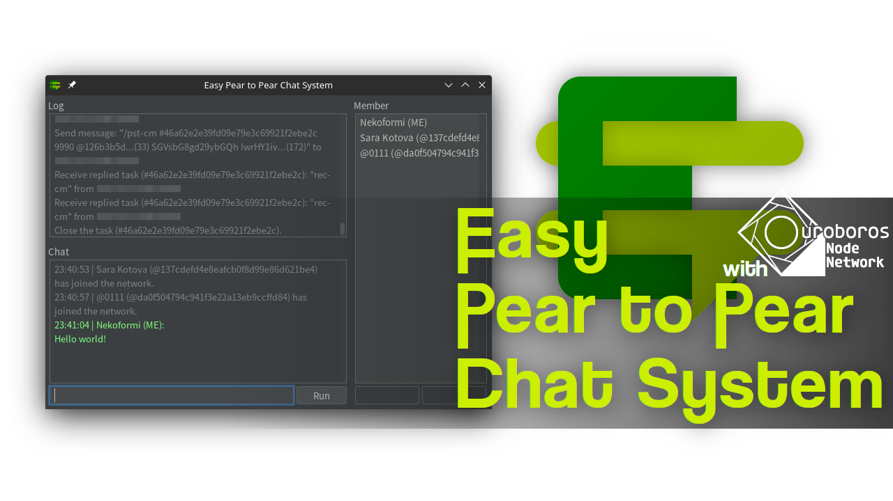

# Easy Pear to Pear Chat System (E=CS)



## What is this?

This is a simple chat system that I created to personally study pear to pear (P2P) and security. It does not require a centralized server, and each nodes to easily form a network.

## How to use?

### Boots

You can execute the application (JAR) file by either double-clicking on it or running it from the command line. For example, like this:

```sh:Bash
$ java -jar E=CS.jar
```

You can customize the launch of the application by adding options to the command line. For example, like this:

```sh:Bash
$ java -jar E=CS.jar -x=0 -y=0 -n="Nekoformi" -join=0.0.0.0:20000,20001 -ssl -debug
```

#### General options

| Option | Type | Default | Effect |
| --- | --- | --- | --- |
| `x` `left` | `<INTEGER>` | 0 | Set the X position of the window. |
| `y` `top` | `<INTEGER>` | 0 | Set the Y position of the window. |
| `w` `width` | `<UNSIGNED INTEGER>` | 640 | Set the width of the window. |
| `h` `height` | `<UNSIGNED INTEGER>` | 480 | Set the height of the window. |
| `c` `center` | `<VOID>` | false | Center the window. |
| `m` `maximize` | `<VOID>` | false | Maximize the window. |
| `n` `name` | `<STRING>` | "Anonymous" | Set the username. It can also be changed within the application. |
| `t` `timeout` | `<UNSIGNED INTEGER>` | 10000 | Set the timeout (in milliseconds). |
| `d` `download` | `<FOLDER PATH>` | ./ | Set the folder to save downloaded files. |
| `force-string` | `<VOID>` | false | The content to be sent in binary will be forcibly transmitted as a string. This option may be useful when clients with different operating systems fail to communicate. |
| `message-size` | `<UNSIGNED INTEGER>` | 4096 | Set the maximum packet size (in byte). This option may be useful when clients with different operating systems fail to communicate. |
| `file-size` | `<UNSIGNED INTEGER>` | 1048576 | Set the split size (in byte) of the file to be sent. The larger the value, the more RAM required for the recipient. |
| `create` | `<LISTENING PORT>` | - | Create a network at startup. |
| `join` | `<ADDRESS>:<PORT>,<LISTENING PORT>` | - | Join the network at startup. |
| `ssl` | `<VOID>` | false | Use SSL (Secure Socket Layer). However, note that the standard state has nonsense on users who know the protocol. |
| `debug` | `<VOID>` | false | Outputs log to the console. |
| `debug-color` | `<VOID>` | false | Colorizes log to the console. Don't use this option if you redirect logs to a file. |

#### Options enabled in SSL mode

| Option | Type | Effect |
| --- | --- | --- |
| `pkc-file` | `<P12 FILE>` | Specifies the PKCS (Public Key Cryptography Standard) file. This is specified as the certificate for both client and server, as it is used for communication between nodes. |
| `pkc-pass` | `<STRING>` | Specifies the passphrase for processing the `pkc-file` if required. |
| `jks-file` | `<JKS FILE>` | Specifies the JKS (Java Key Store) file. This can be created using [keytool](https://docs.oracle.com/javase/10/tools/keytool.htm) with the certificate (CRT file) of the CA that authenticates the client. |
| `jks-pass` | `<STRING>` | Specifies the passphrase for processing the `jks-file` if required. |
| `pkc-server-file` | `<P12 FILE>` | Specifies the PKCS file for the server. |
| `pkc-server-pass` | `<STRING>` | Specifies the passphrase for processing the `pkc-server-file` if required. |
| `pkc-client-file` | `<P12 FILE>` | Specifies the PKCS file for the client. |
| `pkc-client-pass` | `<STRING>` | Specifies the passphrase for processing the `pkc-client-file` if required. |

### Operations

You can post messages or execute commands from the text field at the bottom of the window. For example, like this:

```
/n Nekoformi
/j 0.0.0.0:20000 20001
Hello world!
```

| Command | Argument | Detail |
| --- | --- | --- |
| `c` `create` | `<LISTENING PORT>` | Create a network. |
| `j` `join` | `<ADDRESS>:<PORT>` `<LISTENING PORT>` | Join the network. |
| `l` `leave` | `<VOID>` | Leave the network. |
| `n` `name` | `<STRING ...>` | Set the username. |
| `m` `message` | `<STRING ...>` | Send chat message. |
| `f` `file` | `<FILE PATH ...>` | Upload the file. |
| `fr` `file-request` | `<USER ID>` `<FILE ID>` | Download the file. |
| `ff` `file-free` | `<FILE ID>` | Free the uploaded file (make it unavailable for download). |
| `u` `update` | `<VOID>` | Update user list. |
| `ls` `list` | `<VOID>` | Show user list. |
| `lsk` `list-key` | `<VOID>` | Show the public keys of all users. |
| `cls` `clear` | `<VOID>` | Clear consoles. |
| `clc` `clear-chat` | `<VOID>` | Clear chat history. |
| `cll` `clear-log` | `<VOID>` | Clear log history. |
| `connect` | `<USER ID>` | Connect the node. |
| `disconnect` | `<USER ID>` | Disconnect the node. |
| `delay` | `<USER ID>` `<MILLISECONDS>` | Delay communication with the node (in one direction). This command is intended for testing. |
| `con` `create-on` | (`<USER ID>` `<DUMMY NUM>`) \| (`<MAP STRUCTURE>`) | Create a map of the Ouroboros Node Network. |
| `son` `show-on` | `<USER ID>` | Show a map of the Ouroboros Node Network. |
| `ron` `remove-on` | `<USER ID>` | Remove a map of the Ouroboros Node Network from a string. |
| `eon` `edit-on` | `<USER ID A>` `<USER ID B>` `<USER ID C>` `<USER ID D>` `<FLAG>` | Insert user D between user B and user C on user A's map. |
| `eon` `edit-on` | `<USER ID A>` `<USER ID B>` `<USER ID C>` `<FLAG>` | Add user C after user B on user A's map. |
| `eon` `edit-on` | `<USER ID A>` `<USER ID B>` `<USER ID C>` | Replace user C for user B on user A's map. |
| `eon` `edit-on` | `<USER ID A>` `<USER ID B>` | Delete user B from user A's map. |
| `mon` `message-on` | `<USER ID>` `<STRING ...>` | Send chat message to target using the Ouroboros Node Network. |
| `fon` `file-on` | `<USER ID>` `<FILE PATH ...>` | Send file to target using the Ouroboros Node Network. |

| Flag | Name | Detail |
| --- | --- | --- |
| `DUM` | Dummy | A node that routes message. |
| `PST` | Post | The sending node (myself). |
| `REC` | Receive | The receiving node (target). |
| `FIN` | Finish | The receiving node accepts the termination of communication (cycles). |
| `DEL` | Delete | A node that deletes message. |
| `WAI` | Wait | A dummy node that sends a message after a random period of time. |
| `REP` | Repeat | A dummy node that re-sends a message after a random period of time. |

## Bonus

### How to create PKCS

```sh:Bash
openssl pkcs12 -export \
    -in "<YOUR CERTIFICATE FILE>.crt" \
    -inkey "<YOUR PRIVATE KEY>.key" \
    -certfile "<CA CERTIFICATE FILE>.crt" \
    -passout "<PASS PHRASE>" \
    -out "<EXPORT FILE>.p12"
```

### How to create JKS

```sh:Bash
keytool -import \
    -file "<CA CERTIFICATE FILE>.crt" \
    -storepass "<PASS PHRASE>" \
    -keystore "<EXPORT FILE>.jks"
```

## Used technologies

- [Java Development Kit 22](https://www.oracle.com/java/technologies/downloads/)
- [OpenSSL](https://www.openssl.org/)

## Used libraries

- [FlatLaf](https://www.formdev.com/flatlaf/)

## To do list

- Add function: to send private message.
- Add function: to enhance network security with password.
- Add function: to add clients to blacklist.
